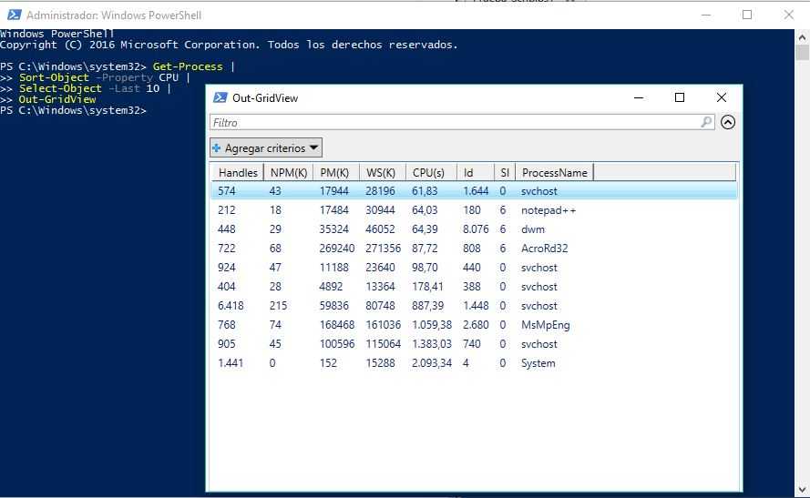

# -- WINDOWS POWERSHELL --

## - CANALIZACIONES -

#### NOTA INICIAL

###### De cara a resolver los siguientes ejercicios en la consola de manera más cómoda y compacta, recuerda que muchos de los cmdlets que se suelen utilizar en canalizaciones tienen alias más cortos y fáciles de teclear. Por ejemplo:

| Cmdlet         | Alias        | Uso                    |
| -------------- | ------------ | ---------------------- |
| Sort-Object    | sort         | Ordena                 |
| Select-Object  | select       | Selecciona propiedades |
| Where-Object   | where        | Filtra                 |
| Measure-Object | measure      | Calcula                |
| Get-Service    | gsv          | Muestra servicios      |
| Get-Process    | ps           | Muestra procesos       |
| Get-ChildItem  | gci, dir, ls | Muestra contenido      |

### Ejercicio 1:

###### Escribe canalizaciones que resuelvan cada uno de los siguientes casos:

###### a) Obtener las propiedades de los objetos devueltos por Get-Service.

```
PS C:\Windows\system32> Get-Service |
>> Get-Member -MemberType Properties


   TypeName: System.ServiceProcess.ServiceController

Name                MemberType    Definition
----                ----------    ----------
Name                AliasProperty Name = ServiceName
RequiredServices    AliasProperty RequiredServices = ServicesDependedOn
CanPauseAndContinue Property      bool CanPauseAndContinue {get;}
CanShutdown         Property      bool CanShutdown {get;}
CanStop             Property      bool CanStop {get;}
Container           Property      System.ComponentModel.IContainer Container {get;}
DependentServices   Property      System.ServiceProcess.ServiceController[] DependentServices {get;}
DisplayName         Property      string DisplayName {get;set;}
MachineName         Property      string MachineName {get;set;}
ServiceHandle       Property      System.Runtime.InteropServices.SafeHandle ServiceHandle {get;}
ServiceName         Property      string ServiceName {get;set;}
ServicesDependedOn  Property      System.ServiceProcess.ServiceController[] ServicesDependedOn {get;}
ServiceType         Property      System.ServiceProcess.ServiceType ServiceType {get;}
Site                Property      System.ComponentModel.ISite Site {get;set;}
StartType           Property      System.ServiceProcess.ServiceStartMode StartType {get;}
Status              Property      System.ServiceProcess.ServiceControllerStatus Status {get;}
```

###### b) Obtener la lista de los servicios del sistema, ordenados por su estado (“Status”).

```
PS C:\Windows\system32> Get-Service |
>> Sort-Object Status

Status   Name               DisplayName
------   ----               -----------
Stopped  seclogon           Inicio de sesión secundario
Stopped  SDRSVC             Copias de seguridad de Windows
................................<<<<<<<<<
Running  SSDPSRV            Detección SSDP
Running  SstpSvc            Servicio de protocolo de túnel de s...
```

###### c) Obtener la lista de los servicios del sistema cuyo estado sea en ejecución.

```
PS C:\Windows\system32> Get-Service |
>> Where-Object Status -EQ running

Status   Name               DisplayName
------   ----               -----------
Running  AdobeARMservice    Adobe Acrobat Update Service
Running  Appinfo            Información de la aplicación
Running  AppMgmt            Administración de aplicaciones
...................<<<<<<<<<<<<<<<<<<<
```

###### d) Obtener la lista de los servicios en ejecución, en orden alfabético inverso (NOTA: Ver propiedad “-Descending” de `Sort-Object`).

```
PS C:\Windows\system32> Get-Service |
>> Sort-Object -Descending |
>> Where-Object Status -EQ running

Status   Name               DisplayName
------   ----               -----------
Running  wudfsvc            Windows Driver Foundation - User-mo...
Running  wuauserv           Windows Update
Running  WSearch            Windows Search
Running  wscsvc             Centro de seguridad
..............<<<<<<<<<<<<<<<
Running  Appinfo            Información de la aplicación
Running  AdobeARMservice    Adobe Acrobat Update Service
```

###### e) Obtener la cantidad de servicios en ejecución (NOTA: Ver Measure-Object).

```
PS C:\Windows\system32> Get-Service |
>> Where-Object Status -EQ running |
>> Measure-Object |
>> Select-Object Count

Count
-----
   87
```

###### f) Reiniciar los servicios que comiencen con el prefijo “net” y que actualmente se encuentren en ejecución.

```
PS C:\Windows\system32> Get-Service net* |
>> Where-Object Status -EQ running

Status   Name               DisplayName
------   ----               -----------
Running  Netman             Conexiones de red
Running  netprofm           Servicio de lista de redes
```

```
PS C:\Windows\system32> Get-Service net* |
>> Restart-Service |
>> Where-Object Status -EQ running
```

### Ejercicio 2:

###### Escribe canalizaciones que resuelvan cada uno de los siguientes casos:

###### a) Obtener las propiedades de los objetos devueltos por Get-Process.

```
PS C:\Windows\system32> Get-Process | Get-Member -MemberType Properties


   TypeName: System.Diagnostics.Process

Name                       MemberType     Definition
----                       ----------     ----------
Handles                    AliasProperty  Handles = Handlecount
Name                       AliasProperty  Name = ProcessName
NPM                        AliasProperty  NPM = NonpagedSystemMemorySize64
PM                         AliasProperty  PM = PagedMemorySize64
SI                         AliasProperty  SI = SessionId
VM                         AliasProperty  VM = VirtualMemorySize64
WS                         AliasProperty  WS = WorkingSet64
__NounName                 NoteProperty   string __NounName=Process
BasePriority               Property       int BasePriority {get;}
Container                  Property       System.ComponentModel.IContainer Container {get;}
EnableRaisingEvents        Property       bool EnableRaisingEvents {get;set;}
ExitCode                   Property       int ExitCode {get;}
ExitTime                   Property       datetime ExitTime {get;}
Handle                     Property       System.IntPtr Handle {get;}
HandleCount                Property       int HandleCount {get;}
HasExited                  Property       bool HasExited {get;}
Id                         Property       int Id {get;}
MachineName                Property       string MachineName {get;}
MainModule                 Property       System.Diagnostics.ProcessModule MainModule {get;}
MainWindowHandle           Property       System.IntPtr MainWindowHandle {get;}
MainWindowTitle            Property       string MainWindowTitle {get;}
MaxWorkingSet              Property       System.IntPtr MaxWorkingSet {get;set;}
MinWorkingSet              Property       System.IntPtr MinWorkingSet {get;set;}
Modules                    Property       System.Diagnostics.ProcessModuleCollection Modules {get;}
NonpagedSystemMemorySize   Property       int NonpagedSystemMemorySize {get;}
NonpagedSystemMemorySize64 Property       long NonpagedSystemMemorySize64 {get;}
PagedMemorySize            Property       int PagedMemorySize {get;}
PagedMemorySize64          Property       long PagedMemorySize64 {get;}
PagedSystemMemorySize      Property       int PagedSystemMemorySize {get;}
PagedSystemMemorySize64    Property       long PagedSystemMemorySize64 {get;}
PeakPagedMemorySize        Property       int PeakPagedMemorySize {get;}
PeakPagedMemorySize64      Property       long PeakPagedMemorySize64 {get;}
PeakVirtualMemorySize      Property       int PeakVirtualMemorySize {get;}
PeakVirtualMemorySize64    Property       long PeakVirtualMemorySize64 {get;}
PeakWorkingSet             Property       int PeakWorkingSet {get;}
PeakWorkingSet64           Property       long PeakWorkingSet64 {get;}
PriorityBoostEnabled       Property       bool PriorityBoostEnabled {get;set;}
PriorityClass              Property       System.Diagnostics.ProcessPriorityClass PriorityClass {get;set;}
PrivateMemorySize          Property       int PrivateMemorySize {get;}
PrivateMemorySize64        Property       long PrivateMemorySize64 {get;}
PrivilegedProcessorTime    Property       timespan PrivilegedProcessorTime {get;}
ProcessName                Property       string ProcessName {get;}
ProcessorAffinity          Property       System.IntPtr ProcessorAffinity {get;set;}
Responding                 Property       bool Responding {get;}
SafeHandle                 Property       Microsoft.Win32.SafeHandles.SafeProcessHandle SafeHandle {get;}
SessionId                  Property       int SessionId {get;}
Site                       Property       System.ComponentModel.ISite Site {get;set;}
StandardError              Property       System.IO.StreamReader StandardError {get;}
StandardInput              Property       System.IO.StreamWriter StandardInput {get;}
StandardOutput             Property       System.IO.StreamReader StandardOutput {get;}
StartInfo                  Property       System.Diagnostics.ProcessStartInfo StartInfo {get;set;}
StartTime                  Property       datetime StartTime {get;}
SynchronizingObject        Property       System.ComponentModel.ISynchronizeInvoke SynchronizingObject {get;set;}
Threads                    Property       System.Diagnostics.ProcessThreadCollection Threads {get;}
TotalProcessorTime         Property       timespan TotalProcessorTime {get;}
UserProcessorTime          Property       timespan UserProcessorTime {get;}
VirtualMemorySize          Property       int VirtualMemorySize {get;}
VirtualMemorySize64        Property       long VirtualMemorySize64 {get;}
WorkingSet                 Property       int WorkingSet {get;}
WorkingSet64               Property       long WorkingSet64 {get;}
Company                    ScriptProperty System.Object Company {get=$this.Mainmodule.FileVersionInfo.CompanyName;}
CPU                        ScriptProperty System.Object CPU {get=$this.TotalProcessorTime.TotalSeconds;}
Description                ScriptProperty System.Object Description {get=$this.Mainmodule.FileVersionInfo.FileDescription;}
FileVersion                ScriptProperty System.Object FileVersion {get=$this.Mainmodule.FileVersionInfo.FileVersion;}
Path                       ScriptProperty System.Object Path {get=$this.Mainmodule.FileName;}
Product                    ScriptProperty System.Object Product {get=$this.Mainmodule.FileVersionInfo.ProductName;}
ProductVersion             ScriptProperty System.Object ProductVersion {get=$this.Mainmodule.FileVersionInfo.ProductVersion;}
```

###### b) Obtener la lista de los procesos en ejecución, ordenada por identificador del proceso.

```
PS C:\Windows\system32> Get-Process |
>> Sort-Object -Property Id

Handles  NPM(K)    PM(K)      WS(K)     CPU(s)     Id  SI ProcessName
-------  ------    -----      -----     ------     --  -- -----------
      0       0        0          4                 0   0 Idle
   1397       0      136       2472   2.415,13      4   0 System
     51       2      356        340       0,22    388   0 smss
..................<<<<<<<<<<<<<<<<
    169      11     4460      13728      36,58   9028   4 conhost
    426      39    37084      12352       0,98   9092   4 DTAgent
```

###### c) Obtener la lista de los procesos en ejecución, ordenada inversamente por la cantidad de CPU utilizada por cada proceso.

```
PS C:\Windows\system32> Get-Process |
>> Sort-Object -Property CPU -Descending

Handles  NPM(K)    PM(K)      WS(K)     CPU(s)     Id  SI ProcessName
-------  ------    -----      -----     ------     --  -- -----------
   1406       0      136       2472   2.421,22      4   0 System
    736      72   162620     153932   1.402,92   2640   0 MsMpEng
    628      34   107760     101372   1.147,48    648   0 svchost
..............<<<<<<<<<<<<<<<<<<<<<<<<<
     92       7     1212       6276       0,03   9916   0 SearchFilterHost
    104       8     1336       6088       0,03   7024   4 typora
    140      10     1792       1808       0,03   2480   0 BtwRSupportService
      0       0        0          4                 0   0 Idle
```

###### d) Obtener, de la lista anterior, el proceso que más CPU ha consumido. 

###### (NOTA: Ver `Select-Object`, que permite seleccionar elementos de una lista por posición, quedarse con los primeros o los últimos N objetos, etc.).

```
PS C:\Windows\system32> Get-Process |
>> Sort-Object -Property CPU -Descending |
>> Select-Object -First 1

Handles  NPM(K)    PM(K)      WS(K)     CPU(s)     Id  SI ProcessName
-------  ------    -----      -----     ------     --  -- -----------
   1399       0      136       2472   2.427,48      4   0 System
```

###### e) Completar la canalización anterior para que el objeto resultante sólo tenga las propiedades “Name” y “Cpu”.

```
PS C:\Windows\system32> Get-Process |
>> sort -Verbose CPU -Descending |
>> Select-Object Name, CPU -First 1

Name           CPU
----           ---
System 4310,578125
```

###### f) Completar la canalización anterior para visualizar el resultado en forma de tabla (NOTA: Ver Format-Table), pero que no ocupe todo el ancho disponible de la consola, sino que ajuste el acho de cada columna al espacio necesario.

```
PS C:\Windows\system32> Get-Process |
>> Sort -Verbose CPU -Descending |
>> Select-Object Name, CPU -First 1 |
>> Format-Table -AutoSize

Name          CPU
----          ---
System 4311,53125
```

###### g) Obtener la cantidad de procesos en ejecución en el sistema, así como el máximo, mínimo y valor medio de su consumo de CPU.

```
PS C:\Windows\system32> Get-Process |
>> Measure-Object -Property cpu -Maximum -Minimum -Average |
>> Format-Table -AutoSize

Count         Average Sum     Maximum  Minimum Property
-----         ------- ---     -------  ------- --------
   97 133,11662371134     4312,171875 0,046875 CPU
```

### Ejercicio 3:

###### Escribe canalizaciones que resuelvan cada uno de los siguientes casos:

###### a) Obtener las propiedades de los objetos devueltos por Get-Childitem c:\Windows (nótese que hay dos tipos de objetos, con algunas propiedades distintas).

```
PS C:\Windows\system32> Get-ChildItem C:\Windows |
>> Get-Member -MemberType Properties


   TypeName: System.IO.DirectoryInfo

Name              MemberType     Definition
----              ----------     ----------
LinkType          CodeProperty   System.String LinkType{get=GetLinkType;}
Mode              CodeProperty   System.String Mode{get=Mode;}
Target            CodeProperty   System.Collections.Generic.IEnumerable`1[[System.String, mscorlib, Version=4.0.0.0, Culture=neutral, PublicKeyToken=b77a5c561934e089]] Target{get=GetTarget;}
PSChildName       NoteProperty   string PSChildName=addins
PSDrive           NoteProperty   PSDriveInfo PSDrive=C
PSIsContainer     NoteProperty   bool PSIsContainer=True
PSParentPath      NoteProperty   string PSParentPath=Microsoft.PowerShell.Core\FileSystem::C:\Windows
PSPath            NoteProperty   string PSPath=Microsoft.PowerShell.Core\FileSystem::C:\Windows\addins
PSProvider        NoteProperty   ProviderInfo PSProvider=Microsoft.PowerShell.Core\FileSystem
Attributes        Property       System.IO.FileAttributes Attributes {get;set;}
CreationTime      Property       datetime CreationTime {get;set;}
CreationTimeUtc   Property       datetime CreationTimeUtc {get;set;}
Exists            Property       bool Exists {get;}
Extension         Property       string Extension {get;}
FullName          Property       string FullName {get;}
LastAccessTime    Property       datetime LastAccessTime {get;set;}
LastAccessTimeUtc Property       datetime LastAccessTimeUtc {get;set;}
LastWriteTime     Property       datetime LastWriteTime {get;set;}
LastWriteTimeUtc  Property       datetime LastWriteTimeUtc {get;set;}
Name              Property       string Name {get;}
Parent            Property       System.IO.DirectoryInfo Parent {get;}
Root              Property       System.IO.DirectoryInfo Root {get;}
BaseName          ScriptProperty System.Object BaseName {get=$this.Name;}


   TypeName: System.IO.FileInfo

Name              MemberType     Definition
----              ----------     ----------
LinkType          CodeProperty   System.String LinkType{get=GetLinkType;}
Mode              CodeProperty   System.String Mode{get=Mode;}
Target            CodeProperty   System.Collections.Generic.IEnumerable`1[[System.String, mscorlib, Version=4.0.0.0, Culture=neutral, PublicKeyToken=b77a5c561934e089]] Target{get=GetTarget;}
PSChildName       NoteProperty   string PSChildName=bfsvc.exe
PSDrive           NoteProperty   PSDriveInfo PSDrive=C
PSIsContainer     NoteProperty   bool PSIsContainer=False
PSParentPath      NoteProperty   string PSParentPath=Microsoft.PowerShell.Core\FileSystem::C:\Windows
PSPath            NoteProperty   string PSPath=Microsoft.PowerShell.Core\FileSystem::C:\Windows\bfsvc.exe
PSProvider        NoteProperty   ProviderInfo PSProvider=Microsoft.PowerShell.Core\FileSystem
Attributes        Property       System.IO.FileAttributes Attributes {get;set;}
CreationTime      Property       datetime CreationTime {get;set;}
CreationTimeUtc   Property       datetime CreationTimeUtc {get;set;}
Directory         Property       System.IO.DirectoryInfo Directory {get;}
DirectoryName     Property       string DirectoryName {get;}
Exists            Property       bool Exists {get;}
Extension         Property       string Extension {get;}
FullName          Property       string FullName {get;}
IsReadOnly        Property       bool IsReadOnly {get;set;}
LastAccessTime    Property       datetime LastAccessTime {get;set;}
LastAccessTimeUtc Property       datetime LastAccessTimeUtc {get;set;}
LastWriteTime     Property       datetime LastWriteTime {get;set;}
LastWriteTimeUtc  Property       datetime LastWriteTimeUtc {get;set;}
Length            Property       long Length {get;}
Name              Property       string Name {get;}
BaseName          ScriptProperty System.Object BaseName {get=if ($this.Extension.Length -gt 0){$this.Name.Remove($this.Name.Length - $this.Extension.Length)}else{$this.Name};}
VersionInfo       ScriptProperty System.Object VersionInfo {get=[System.Diagnostics.FileVersionInfo]::GetVersionInfo($this.FullName);}
```

###### b) Obtener la lista de archivos con extensión “.EXE” de c:\Windows\System32.

1. ```
   PS C:\Windows\system32> Get-ChildItem C:\Windows\system32\*.exe


       Directorio: C:\Windows\system32


   Mode                LastWriteTime         Length Name
   ----                -------------         ------ ----
   -a----       16/07/2016     13:42          23040 acu.exe
   -a----       15/09/2017      0:39        1227264 AgentService.exe
   -a----       10/02/2018      6:00        2003288 aitstatic.exe
   .................<<<<<<<<<<<<<<<<<<<<
   -a----       16/07/2016     13:42          47616 xcopy.exe
   -a----       10/02/2018      5:03        4596736 xpsrchvw.exe
   -a----       16/07/2016     13:42          63488 xwizard.exe
   ```

2. ```
   PS C:\Windows\system32> Get-ChildItem C:\Windows\System32\ |
   >> Where-Object {$_.Extension -eq ".exe"}


       Directorio: C:\Windows\System32


   Mode                LastWriteTime         Length Name
   ----                -------------         ------ ----
   -a----       16/07/2016     13:42          23040 acu.exe
   -a----       15/09/2017      0:39        1227264 AgentService.exe
   -a----       10/02/2018      6:00        2003288 aitstatic.exe
   -a----       16/07/2016     13:42          95744 alg.exe
   -a----       16/07/2016     13:42         104448 AppHostRegistrationVerifier.exe
   .............<<<<<<<<<<<<<<<<<
   -a----       16/07/2016     13:42          47616 xcopy.exe
   -a----       10/02/2018      5:03        4596736 xpsrchvw.exe
   -a----       16/07/2016     13:42          63488 xwizard.exe
   ```

   ​


###### c) Repetir la canalización anterior, pero de manera recursiva, es decir, incluyendo las subcarpetas de c:\Windows\System32. (NOTA: Revisar los parámetros del cmdlet Get-Childitem).

1. ```
   PS C:\Windows\system32> Get-ChildItem C:\Windows\System32\*.exe -Recurse


       Directorio: C:\Windows\System32\Boot


   Mode                LastWriteTime         Length Name
   ----                -------------         ------ ----
   -a----       10/02/2018      5:54        1174552 winload.exe
   -a----       10/02/2018      5:54         894640 winresume.exe


       Directorio: C:\Windows\System32\Com


   Mode                LastWriteTime         Length Name
   ----                -------------         ------ ----
   ..............<<<<<<<<<<<<<<<<<<<<<<<<<<<<<
   -a----       16/07/2016     13:42          47616 xcopy.exe
   -a----       10/02/2018      5:03        4596736 xpsrchvw.exe
   -a----       16/07/2016     13:42          63488 xwizard.exe
   ```

2. ```
   PS C:\Windows\system32> Get-ChildItem C:\Windows\System32\ -Recurse |
   >> Where-Object {$_.Extension -eq ".exe"}


       Directorio: C:\Windows\System32


   Mode                LastWriteTime         Length Name
   ----                -------------         ------ ----
   -a----       16/07/2016     13:42          23040 acu.exe
   -a----       15/09/2017      0:39        1227264 AgentService.exe
   ..............<<<<<<<<<<<<<<<<<<<<<<
   -a----       11/01/2018      7:27         494080 WmiPrvSE.exe


       Directorio: C:\Windows\System32\WindowsPowerShell\v1.0


   Mode                LastWriteTime         Length Name
   ----                -------------         ------ ----
   -a----       17/12/2016     15:50         446976 powershell.exe
   -a----       17/12/2016     15:50         212992 powershell_ise.exe
   ```

   ​


###### d) Obtener la lista de archivos con extensión “.EXE” de c:\Windows\System32, incluyendo sus subcarpetas, y ordenar la salida por tamaño de archivo, en orden inverso. Notarás un retardo inicial en visualizar el resultado esta canalización. ¿A qué crees que es debido?

```
PS C:\Windows\system32> Get-ChildItem C:\Windows\System32\ -Recurse |
>> Where-Object {$_.Extension -eq ".exe"} |
>> Sort-Object -Property Length -Descending
```

`El retardo es debido a que dentro de system32 hay muchas subcarpetas las cuales se buscan recursivamente.`

###### e) Obtener la lista de los 10 archivos con extensión “.EXE” de mayor tamaño de la carpeta c:\Windows\System32 y sus subcarpetas.

```
PS C:\Windows\system32> Get-ChildItem C:\Windows\System32\ -Recurse |
>> Where-Object {$_.Extension -eq ".exe"} |
>> Sort-Object -Property Length -Descending |
>> Select-Object -First 10


    Directorio: C:\Windows\System32


Mode                LastWriteTime         Length Name
----                -------------         ------ ----
-a----       11/01/2018      4:28      129365736 MRT-KB890830.exe
-a----       11/01/2018      4:28      129365736 MRT.exe


    Directorio: C:\Windows\System32\DriverStore\FileRepository\nvam.inf_amd64_7212395df162396b


Mode                LastWriteTime         Length Name
----                -------------         ------ ----
-a----       22/03/2016      6:57       94981072 NvCplSetupInt.exe


    Directorio: C:\Windows\System32\DriverStore\FileRepository\hdxama3.inf_amd64_7e5107d78c84ef59


Mode                LastWriteTime         Length Name
----                -------------         ------ ----
-a----       10/11/2015      6:19       16174352 RAVCpl64.exe
-a----       10/11/2015      6:20        8529168 RtkNGUI64.exe


    Directorio: C:\Windows\System32


Mode                LastWriteTime         Length Name
----                -------------         ------ ----
-a----       01/01/2018      6:24        7812952 ntoskrnl.exe
-a----       18/11/2017      4:29        6664192 mspaint.exe
-a----       17/12/2016     15:50        5622088 sppsvc.exe
-a----       18/09/2017      4:16        4596224 xpsrchvw.exe
-a----       04/05/2016      0:30        4401632 Gfxv4_0.exe
```


###### f) Obtener la suma del tamaño de los 10 archivos con extensión “.EXE” de mayor tamaño de la carpeta c:\Windows\System32 y sus subcarpetas.

```
PS C:\Windows\system32> Get-ChildItem C:\Windows\System32\ -Recurse |
>> Where-Object {$_.Extension -eq ".exe"} |
>> Sort-Object -Property Length -Descending |
>> Select-Object -First 10 |
>> Measure-Object -Property length -Sum |
>> Format-Table -AutoSize

Count Average       Sum Maximum Minimum Property
----- -------       --- ------- ------- --------
   10         407513152                 Length
```


### Ejercicio 4:

###### Te han encargado que obtengas información acerca de los 10 procesos que más CPU han consumido en un momento dado en un sistema Windows. En primer lugar, escribe una canalización que resuelva esta tarea y muestre su resultado en pantalla (NOTA: Puedes basarte en el ejercicio 2 de este boletín).

###### A continuación, completa esa canalización de las formas siguientes, donde cada una establece un formato o soporte de salida distintos, y que puede resultarte útil en ocasiones diferentes:

```
PS C:\Windows\system32> Get-Process |
>> Sort-Object -Property CPU |
>> Select-Object -Last 10

Handles  NPM(K)    PM(K)      WS(K)     CPU(s)     Id  SI ProcessName
-------  ------    -----      -----     ------     --  -- -----------
   1386      73   168748     178416     311,66   5508   4 AcroRd32
   7956     201    56136      60008     321,91    468   0 svchost
    470      54   121588     137520     346,41   3568   4 Typora
    462      24     2144       6580     396,03   4008   4 csrss
   2034     104   146352     144200     516,02   8232   4 explorer
    537      36    49236      43940   1.095,98   6676   4 dwm
   1213     100   203376     236416   1.185,73   4944   4 firefox
    756      73   171792     183488   1.649,73   2640   0 MsMpEng
    707      38   113756     106296   1.894,23    648   0 svchost
   1412       0      136       3372   4.510,28      4   0 System
```

###### a) Visualizar solamente el nombre de los procesos implicados, o bien los consumos de CPU (ver Format-Wide).

```
PS C:\Windows\system32> Get-Process |
>> Sort-Object -Property CPU |
>> Select-Object -Last 10 |
>> Format-Wide -Property processname -Column 1


AcroRd32
svchost
Typora
csrss
explorer
dwm
firefox
MsMpEng
svchost
System
```

###### b) Visualizar el resultado en una ventana distinta a la consola (ver Out GridView).

```
PS C:\Windows\system32> Get-Process |
>> Sort-Object -Property CPU |
>> Select-Object -Last 10 |
>> Out-GridView
```



###### c) Guardar el resultado en un fichero de texto denominado MasCPU.txt. (Posteriormente, puedes abrir este fichero con el Bloc de notas o cualquier procesador de textos).

```
PS C:\Windows\system32> Get-Process |
>> Sort-Object -Property CPU |
>> Select-Object -Last 10 >> C:\Users\Lescavi\Downloads\MasCPU.txt
```

###### d) Guardar el resultado en un fichero HTML denominado MasCPU.html. (Posteriormente, puedes abrir este fichero con un navegador web).

```
PS C:\Windows\system32> Get-Process |
>> Sort-Object -Property CPU |
>> Select-Object -Last 10 |
>> ConvertTo-Html >> C:\Users\Lescavi\Downloads\MasCPU.html
```

###### e) Guardar el resultado en un fichero CSV denominado MasCPU.csv. (Este fichero puede ser abierto con una hoja de cálculo, por ejemplo, para un procesamiento posterior).

```
PS C:\Windows\system32> Get-Process |
>> Sort-Object -Property CPU |
>> Select-Object -Last 10 |
>> ConvertTo-Csv >> C:\Users\Lescavi\Downloads\MasCPU.csv
```