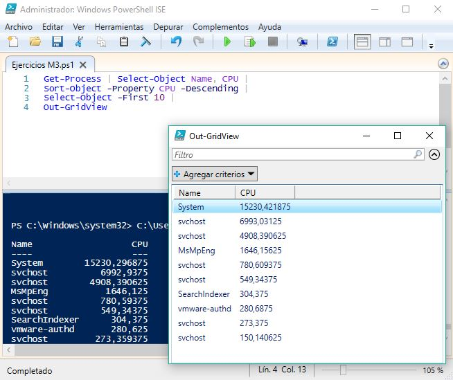

# | Ejercicios de Repaso |

# -- Simulacro de Examen --

###### 1) Escribe un scrip en Powershell que, dado un proceso por teclado emita un mensaje que diga:

```
Proceso X encontrado
Id  Name CPU
--  ---- ----
2   scss   22.22
```
###### Si no lo encuentra: `Proceso X no encontrado`

###### -------------------------------------------- Respuesta 1:

```
Get-Process
Write-Host

$n = Read-Host "Introduce un nº de proceso"
$p = Get-Process -Id $n

Write-Host
foreach ($r in $p){
       
    Write-Host $r.Product":"
    echo $r
        
    }

        Write-Host

        if ($r -eq $p){

        Write-Host "- Proceso ""$n"" encontrado !!!"

        }
        else {
            Write-Host "- Proceso ""$n"" no encontrado..."
            Write-Host "¡ Ese proceso no existe o no se está ejecutando !"
        }
```

###### 2) Crea un fichero y dale nombre y lo guardas en `C:\users\usuaro\Documents.`

```
PS C:\Windows\system32> New-Item -ItemType File C:\Users\Lescavi\Documents\"Ejercicio_2.txt"


    Directorio: C:\Users\Lescavi\Documents


Mode                LastWriteTime         Length Name                             
----                -------------         ------ ----                             
-a----       06/03/2018      9:09              0 Ejercicio_2.txt                  
```

###### Ahora haz un script que realice una búsqueda de un fichero introducido por teclado (utilizamos el anteriormente creado) sobre `C:\Users\usuario`. El script debe enviar un mensaje de encontrado y visualizar su ubicación. Si no lo encuentra, emite un mensaje de `fichero X no econtrado`

###### -------------------------------------------- Respuesta 2:

```
Get-ChildItem C:\Users\Lescavi\Documents\

Write-Host
Write-Host ---------------------------------------------------------
Write-Host
Write-Host "Del directorio mostrado."
Write-Host 
[String]$a = Read-Host "# Intrduce nombre de fichero"
[String]$b = Get-ChildItem C:\Users\Lescavi\Documents\ -Name $a


Write-Host
foreach ($x in $b){   

        if ($x -eq $a) {

        write-host ---------------------------------------------------------
        write-host
        write-host "Fichero buscado: $a"
        write-host

        Write-Host "- Fichero ""$x"" encontrado !!!"
        Write-Host
        Write-Host "Ruta relativa: " 
        Resolve-Path -Relative C:\Users\Lescavi\Documents\$x
        Write-Host
        Write-Host "Ruta absoluta: " 
        Split-Path C:\Users\Lescavi\Documents\$x

    }
    else {

        Get-ChildItem C:\Users\Lescavi\Documents\
        Write-Host
        Write-Host ---------------------------------------------------------
        Write-Host
        Write-Host "- Fichero ""$a"" no encontrado..."
        Write-Host
        Write-Host "Ruta: ¿?¿?¿?¿?¿?¿?"
        Write-Host
        Write-Host "Comprueba que está bien escrito"

    }

    }
```

###### 3) Te han encargado que obtengas información acerca de los 10 procesos que más CPU han  consumido en un momento dado en un sistema Windows. En primer lugar, escribe un script que realice lo siguiente (se puede utilizar un menú):

a) Visualizar solamente el nombre de los procesos implicados y los consumos de  CPU.

```
Get-Process | Select-Object Name, CPU |
Sort-Object -Property CPU -Descending |
Select-Object -First 10
```

```
PS C:\Windows\system32> C:\Users\Lescavi\Downloads\Scripts\Ejercicios M3.ps1

Name                  CPU
----                  ---
System        15229,53125
svchost        6991,21875
svchost       4908,328125
MsMpEng       1644,203125
svchost          780,5625
svchost          549,3125
SearchIndexer     304,375
vmware-authd        280,5
svchost        273,359375
svchost        150,109375
```

b) Visualizar el resultado en una ventana distinta a la consola (ver `Out-GridView`).

```
Get-Process | Select-Object Name, CPU |
Sort-Object -Property CPU -Descending |
Select-Object -First 10 |
Out-GridView
```



c) Guardar el resultado en un fichero de texto denominado MasCPU.txt. (Abrir fichero)

```
Get-Process | Select-Object Name, CPU |
Sort-Object -Property CPU -Descending |
Select-Object -First 10 >> C:\Users\Lescavi\"MasCPU.txt"
```

d) Guardar el resultado en un fichero HTML denominado MasCPU.html. (Abrir fichero)

```
Get-Process | Select-Object Name, CPU |
Sort-Object -Property CPU -Descending |
Select-Object -First 10 |
ConvertTo-Html >> C:\Users\Lescavi\MasCPU.html
```

e) Guardar el resultado en un fichero CSV denominado MasCPU.csv. (Abrir fichero)


    Get-Process | Select-Object Name, CPU |
    Sort-Object -Property CPU -Descending |
    Select-Object -First 10 |
    ConvertTo-Csv >> C:\Users\Lescavi\Downloads\MasCPU.csv

###### Resultado (Script):

```
Write-Host
Write-Host
Write-Host "#######  -|-  MENÚ  -|-  #########################"
Write-Host "#                                                #"
Write-Host "#   1. Ver nombre de procesos y CPU              #"
Write-Host "#   2. Ver el mismo resultado en otra ventana    #"
Write-Host "#   3. Guardar resultado como "".txt""             #"
Write-Host "#   4. Guardar resultado como "".html""            #"
Write-Host "#   5. Guardar resultado como "".csv""             #"
Write-Host "#                                                #"
Write-Host "##################################################"
Write-Host
Write-Host
$n = Read-Host "- Selecciona una opción"
Write-Host


$a = Get-Process | Select-Object Name, CPU |
Sort-Object -Property CPU -Descending |
Select-Object -First 10 

Switch ($n) {
    
1 {
    echo "-- Nombre y procesos de la CPU --" $a
}

2 {
    echo "-- Mostrar en otra ventana --" $a | Out-GridView
}

3 {
    echo "-- Crear un "".txt y abrir documento"" --" $a >> C:\Users\Lescavi\"MasCPU.txt" 
    C:\Users\Lescavi\"MasCPU.txt"
}

4 {
    echo "-- Crear un "".html y abrir documento"" --" $a | ConvertTo-Html >> C:\Users\Lescavi\"MasCPU.html"
    C:\Users\Lescavi\"MasCPU.html"
}

5 {
    echo "-- Crear un "".csv y abrir documento"" --" $a >> C:\Users\Lescavi\"MasCPU.csv"
    C:\Users\Lescavi\"MasCPU.csv"
}

        Default {Write-Host "Esa opción no se encuentra en el menú"}

}
```

###### 4) Tenemos el siguiente fichero:

```
Nombre,cuenta,email,id,grupo
abc,user1,a@mail.com,122,users
def,user2,b@mail.com,133,users
ghi,user3,c@mail.com,222,admin
jkl,user4,d@mail.com,333,users
mnp,user7,e@mail.com,444,admin
```

###### Realiza un script que:

    a) Cuente las líneas
    b) Busque un usuario cuyo patrón sea introducido por teclado
    d) Diga si existe y muestre la línea
    e) Si no, emita un resultado negativo.
